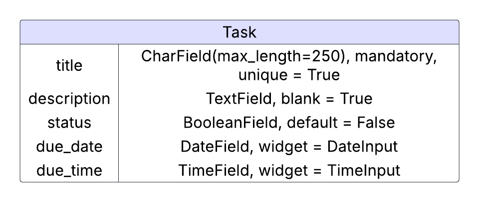

# DTS Developer Challenge - Task Manager API

This is the task manager API for the coding challenge for the MOJ Junior Software Developer. The backend for the task manager application is written in the Python language, using the Django REST Framework to create a RESTful API.

## Planning

### Data Model

A simple entity relation diagram was created for the Task model, created with lucidchart.

For simplicity, no User model is being used and the Task model will allow CRUD functionality of tasks to be global. In a real world situation, the User model would be incorporated as a foreign key for an 'owner' field, and authentication for the app would be created.

Each task has the option of a title, an optional description (indicated by blank = True), a status which can toggle between incomplete and complete, a due date and a due time.

### Task API Endpoints

Below is each of the API endpoints with it's HTTP method, URL and the generic view classes used for each endpoint.

| HTTP Method | URL         | CRUD Operation | CRUD Description                 | DRF Generic View             |
| ----------- | ----------- | -------------- | -------------------------------- | ---------------------------- |
| GET         | /tasks/     | read           | view list of tasks on tasks page | ListCreateAPIView            |
| GET         | /tasks/:id/ | read           | view task detail by id           | RetrieveUpdateDestroyAPIView |
| POST        | /tasks/     | create         | create a new task                | ListCreateAPIView            |
| PUT         | /tasks/:id/ | update         | edit a task by id                | RetrieveUpdateDestroyAPIView |
| DELETE      | /tasks/:id/ | delete         | delete a task by id              | RetrieveUpdateDestroyAPIView |